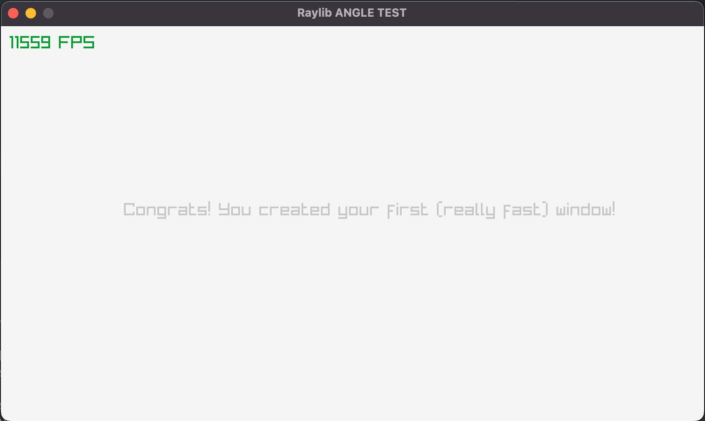
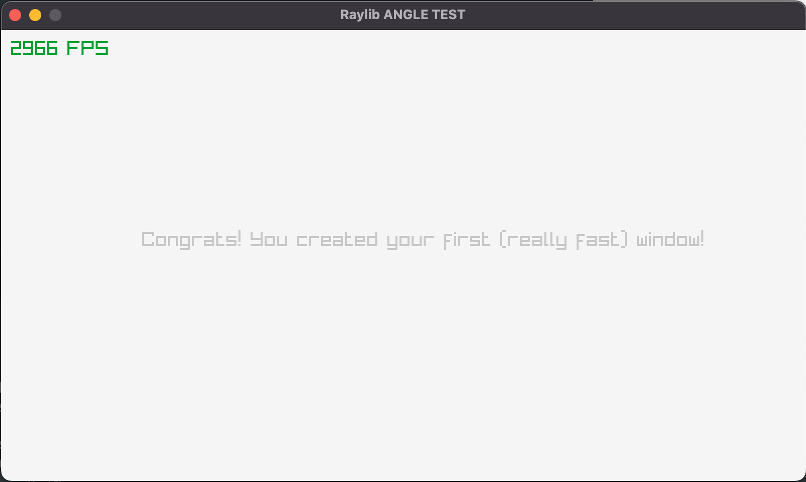

# Building and Linking Google's ANGLE with Raylib on MacOS

## Table of Contents
- [Building and Linking Google's ANGLE with Raylib on MacOS](#building-and-linking-google-s-angle-with-raylib-on-macos)
  * [1. Introduction](#1-introduction)
  * [2. Why use ANGLE anyway?](#2-why-use-angle-anyway-)
  * [3. Quickstart (Short Version Using ANGLE from your Browser)](#3-quickstart--short-version-using-angle-from-your-browser-)
  * [4. Slightly Longer Version](#4-slightly-longer-version)
    + [4.1 Folder Structure & Setup](#41-folder-structure---setup)
    + [4.2 Git submodules](#42-git-submodules)
    + [4.2 Building Angle](#42-building-angle)
    + [4.3 Building the Project](#43-building-the-project)
    + [4.4 Performance](#44-performance)
    + [6. Troubleshooting](#6-troubleshooting)
  * [Conclusion](#conclusion)

## 1. Introduction

If there's one thing I like more than computer graphics, it' fast computer graphics...

By the end of this post, you'll know you how to build and link Google's ANGLE with Raylib, giving at least a 3x boost in raw frame-rate on Macs with M1/M2 chips. In fact, its the same low-level graphics library that powers Google Chrome! (And any chromium based browsers)

This tutorial assumes some basic knowledge of compiling C/C++ software and some comfort in the command line.

**Prerequisites**

You'll also need the followng prerequisites:


1. Apple Developer Command Line Tools (required)
2. VS Code (recommended)
3. Homebrew (recommended)
4. Ninja `brew install ninja`
5. CMake `brew install cmake`
4. Python 3 (required)
5. Git (required)


> The impatient can skip to the [Short Version](#3-quickstart-short-version-using-angle-from-your-browser), showing your how to heist `libEGL.dylib` and `libGLESv2.dylib` from Chrome.

> If you'd like a more complete guide, and want to learn how to build raylib and ANGLE from scratch and tie it together in a nice cmake project, please checkout the [Slightly Longer Version](#4-slightly-longer-version)


## 2. Why use ANGLE anyway?

It seem's everyone's got their own graphics API these days. Microsoft sees the future in Direct3D. Kronos (developer of the OpenGL and Vulkan specs) sees Vulkan as the next-gen solution. Apple on the other hand, true to their nature of building fullstack, hardware and software products, choose freedom and flexibility and decided they too needed their own shiny accelerated graphics API - Metal

NVidia supports as many as it can, they just want to sell hardware.

Now usually, OpenGL has a pretty good cross-platform support. And thats usually the go-to for anything cross platform. But with Apple focusing on Metal and essentially deprecating OpenGL support in 2018, performance of the OpenGL drivers on Mac hasn't seen much love and likely won't in the future. The good news is, Metal can get about 10x more draw calls than OpenGL, especially on modern M1/M2 chips.

With all these different APIs, abstraction layers are starting to pop up. In fact, Google develops such an API thats present in all Chromium based browsers called ANGLE. It provides a compliant OpenGL ES 2.0 frontend with backends to all the major native graphics APIs. 

> In short, you can get HUGE speed boosts when using Metal through ANGLE on MacOS platforms. Usually double, tripple, or even more the framerate of OpenGL powered solutions.

## 3. Quickstart (Short Version Using ANGLE from your Browser)

Shout out to [Peter0x44](https://github.com/Peter0x44) on Github and Raylib's Discord server for pointing this out, but you can actually just grab ANGLE in the form of `libEGL.dylib` and `libGLESv2.dylib` from a Chromium based browser your probably already have!

So here we go.

**Step 1: Hiest `libEGL.dylib` and `libGLESv2.dylib` from Chrome**

Using Chrome for example, lets dig down into the `.app` and grab these files. We'll use the `find` command:

```shell
cd /Applications/Google\ Chrome.app
find ./ -name 'libEGL.dylib'
```


Your output should look something like this. Sweet.

```
.//Contents/Frameworks/Google Chrome Framework.framework/Versions/113.0.5672.126/Libraries/libEGL.dylib
.//Contents/Frameworks/Google Chrome Framework.framework/Versions/114.0.5735.90/Libraries/libEGL.dylib
```

You can now locate `libGLESv2.dylib`:

```
find ./ -name 'libGLESv2.dylib'
```

Boom:

```
.//Contents/Frameworks/Google Chrome Framework.framework/Versions/113.0.5672.126/Libraries/libGLESv2.dylib
.//Contents/Frameworks/Google Chrome Framework.framework/Versions/114.0.5735.90/Libraries/libGLESv2.dylib
```

**Step 2: Copy `libEGL.dylib` and `libGLESv2.dylib` raylib to your project folder**

```
cd <your project>
cp "/Applications/Google Chrome.app/Frameworks/Google Chrome Framework.framework/Versions/114.0.5735.90/Libraries/libGLESv2.dylib" ./
cp "/Applications/Google Chrome.app/Contents/Frameworks/Google Chrome Framework.framework/Versions/114.0.5735.90/Libraries/libEGL.dylib" ./
```

**Step 3: Link with raylib**

Here's a one-liner if you're using a static build of raylib:
```bash
g++ -std=c++14 -I/path/to/raylib/include -o main main.cpp /path/to/raylib.a /path/to/libEGL.dylib /path/to/libGLESv2.dylib
```

## 4. Slightly Longer Version

A single `g++` or `gcc` command is fine for small projects, but for most projects, you're going to want a build system. We'll go with CMake since it seems to be the defactor standard for C/C++ projects.

### 4.1 Folder Structure & Setup

**Step 1: Folder setup**

Go ahead and pick a root project on your computer. I suggest something like `~/code/raylib-angle` or something easy.

Put the following in the folder:

```
.
├── CMakeLists.txt
├── src
│   └── main.cpp
└── vendor
```

After we setup git submodules, and add some source code, it should look something like this:

```
.
├── CMakeLists.txt
├── build
├── src
│   └── main.cpp
└── vendor
    ├── angle
    ├── raygui
    └── raylib
```

### 4.2 Git submodules

While you can certainly link with raylib static builds, I like to keep everything bundled as source code you can compile without fuss. So lets add `raylib` and `raygui` if you're feeling adventurous.

**Add raylib as a submodule to `vender/raylib`**

```
git submodule add https://github.com/raysan5/raylib.git vendor/raylib
```

**Add raylib as a submodule to `vendor/raygui`**

```
git submodule add https://github.com/raysan5/raygui.git vendor/raygui
```

**Add ANGLE as a submodule to `vendor/angle`**

```
git submodule add https://chromium.googlesource.com/angle/angle vendor/angle
```

**Initialize the submodules**
You only really need to do this if you're cloning your root repo, but as a reminder for the future run:

```
git submodule update --init --recursive
```

Cool, now lets build ANGLE

### 4.2 Building Angle

I haven't quite got this tied into my `CMakeLists.txt` yet since angle uses a separate build system, `ninja` (which is crazy fast btw), so we'll build ANGLE separately for now.

**Step 1: Bootstrap ANGLE**

```
cd vendor/angle
python3 scripts/bootstrap.py
gclient sync
```

**Step 2: Generate Ninja Build Files**

```
gn gen out/Release --args='is_debug=false'
```

Here we generated build files for release (optimized) build, but you can generate a Debug build my removing `--args='is_debug=false' and running `gn gen out/Debug`

**Step 3: Compile Angle**

This step will take a hot minute. It took about 10 mins on my 2021 Macbook M1 Pro. The debug build was about half that time.

```
ninja -j 10 -k1 -C out/Release
```

Here I used all 10 CPUs. Use something appropriate for your system.

When complete, the shared libraries (dylib's) you want are `libEGL.dylib` and `libGLESv2.dylib` found in the `vendor/angle/out/Release/` copy those too your project root: `~/code/raylib-angle` (or whatever yours is)

### 4.3 Building the Project

Now lets setup a quick `CMakeLists.txt` and compile raylib and its bundled code like `glfw`

**Step 1: Create CMakeLists.txt**

Add this to `<project-root>/CMakeLists.txt`

```cmake
cmake_minimum_required(VERSION 3.16)

project(raylib-starter)

set(CMAKE_CXX_STANDARD 14)

# Add raylib subdir
add_subdirectory(vendor/raylib)

# Add my sources
file(GLOB_RECURSE SOURCES "src/*.cpp")
add_executable(${PROJECT_NAME} ${SOURCES})

# Define path to ANGLE libraries
set(ANGLE_LIBRARY_DIR vendor/angle/out/Release)

# Find ANGLE libraries
find_library(ANGLE_GLESv2_LIBRARY libGLESv2.dylib PATHS ${ANGLE_LIBRARY_DIR})
find_library(ANGLE_EGL_LIBRARY libEGL.dylib PATHS ${ANGLE_LIBRARY_DIR})

# Add raylib include directory
target_include_directories(${PROJECT_NAME} PRIVATE vendor/raylib/src)

# Add raygui include directory
target_include_directories(${PROJECT_NAME} PRIVATE vendor/raygui/src)

# Add ANGLE include directory
target_include_directories(${PROJECT_NAME} PRIVATE vendor/angle/include)

# Link against raylib and ANGLE libraries
target_link_libraries(${PROJECT_NAME} raylib ${ANGLE_EGL_LIBRARY} ${ANGLE_GLESv2_LIBRARY})

```

**Step 2: Create `<project-root>src/main.cpp`**

Here's some hello world raylib code:

```cpp
#include "raylib.h"

int main(void)
{

    const int screenWidth = 800;
    const int screenHeight = 450;

    InitWindow(screenWidth, screenHeight, "raylib [core] example - basic window");

    SetTargetFPS(60); 

    while (!WindowShouldClose()) 
    {
        BeginDrawing();
            ClearBackground(RAYWHITE);
            DrawText("Congrats! You created your first window!", 190, 200, 20, LIGHTGRAY);

            DrawFPS();
        EndDrawing();
    }
    CloseWindow();
    return 0;
}
```

**Step 3: Generate CMake Build Files**

```
cmake -DCUSTOMIZE_BUILD=ON -DOPENGL_VERSION="ES 2.0" -B build
cmake --build build
```

The flags `-DCUSTOMIZE_BUILD=ON -DOPENGL_VERSION="ES 2.0"` are key. They tell Tell raylib to look for an OpenGL ES implementation which ANGLE will provide. You can find more about the cmake flags on the [Raylib Wiki](https://github.com/raysan5/raylib/wiki/CMake-Build-Options)

**Step 3: Validation**

Here you can see can see our raylib project is using Googles OpenGL ES implementation backed by Metal.

```
λ ~/code/projects/raylib-angle-test/ master* ./r
INFO: Initializing raylib 4.6-dev
INFO: Supported raylib modules:
INFO:     > rcore:..... loaded (mandatory)
INFO:     > rlgl:...... loaded (mandatory)
INFO:     > rshapes:... loaded (optional)
INFO:     > rtextures:. loaded (optional)
INFO:     > rtext:..... loaded (optional)
INFO:     > rmodels:... loaded (optional)
INFO:     > raudio:.... loaded (optional)
INFO: DISPLAY: Device initialized successfully
INFO:     > Display size: 1920 x 1080
INFO:     > Screen size:  800 x 450
INFO:     > Render size:  800 x 450
INFO:     > Viewport offsets: 0, 0
INFO: GLAD: OpenGL ES2.0 loaded successfully
INFO: GL: Supported extensions count: 104
INFO: GL: OpenGL device information:
INFO:     > Vendor:   Google Inc. (Apple)
INFO:     > Renderer: ANGLE (Apple, Apple M1 Pro, OpenGL 4.1 Metal - 76.3)
INFO:     > Version:  OpenGL ES 3.0.0 (ANGLE 2.1.21199 git hash: b0e9bbd79fb6)
INFO:     > GLSL:     OpenGL ES GLSL ES 3.00 (ANGLE 2.1.21199 git hash: b0e9bbd79fb6)
INFO: GL: VAO extension detected, VAO functions loaded successfully
INFO: GL: NPOT textures extension detected, full NPOT textures supported
INFO: TEXTURE: [ID 1] Texture loaded successfully (1x1 | R8G8B8A8 | 1 mipmaps)
INFO: TEXTURE: [ID 1] Default texture loaded successfully
INFO: SHADER: [ID 1] Vertex shader compiled successfully
INFO: SHADER: [ID 2] Fragment shader compiled successfully
INFO: SHADER: [ID 3] Program shader loaded successfully
INFO: SHADER: [ID 3] Default shader loaded successfully
INFO: RLGL: Render batch vertex buffers loaded successfully in RAM (CPU)
INFO: RLGL: Render batch vertex buffers loaded successfully in VRAM (GPU)
INFO: RLGL: Default OpenGL state initialized successfully
INFO: TEXTURE: [ID 2] Texture loaded successfully (128x128 | GRAY_ALPHA | 1 mipmaps)
INFO: FONT: Default font loaded successfully (224 glyphs)
INFO: TIMER: Target time per frame: 16.667 milliseconds
INFO: SYSTEM: Decompress data: Comp. size: 1059 -> Original size: 131072
INFO: TEXTURE: [ID 3] Texture loaded successfully (256x256 | GRAY_ALPHA | 1 mipmaps)
```


### 4.4 Performance

**With ANGLE**



Yes... Thats 11 thousand + FPS you see correctly. I even have a Chrome Browser running spotify and VS Code Running. Granted, raylib's not doing much here, but still!


**Without ANGLE**




Yeah... nuf said. Thats **nearly 4 times faster**. ANGLE is definitely WORTH it on MacOS and M1/M2 Chips.

### 6. Troubleshooting

If you get an error like when compiling like this:

```
error: incompatible pointer types assigning to 'int *' from 'bool *'
    if (active == NULL) active = &temp;
```

Just edit this line in `vendor/raygui/src/raygui.h` and change these lines:

```
    bool temp = false;
    if (active == NULL) active = &temp;
```

to

```
    bool temp = false;
    if (active == NULL) active = (int *)&temp;
```

This casts `temp`, which is a `bool *` to an `int *`

You could also change `bool temp` to `int temp`

> I'll submit a pull request for this fix later. This may not be an issue by the time you read this.

## Conclusion

That's all for now! ANGLE may not give the same speed improvement on other platforms like Windows and Linux, but I may be wrong. 
ANGLE support in Raylib is still experimental, but this pretty much confirms it works!

I hope to be back with some more Raylib writeups. For now, Go checkout ray's awesome ecosystem show the project some love at:

- https://www.raylib.com/
- https://www.raylibtech.com/
- https://github.com/raysan5/raylib
- https://www.patreon.com/raylib
- https://discord.gg/raylib

If you'd like the starter pack code we setup today, you can find that at https://github.com/grplyler/raylib-cmake-starter

Until next time! Keep programming!

-Ryan "Vortigon"